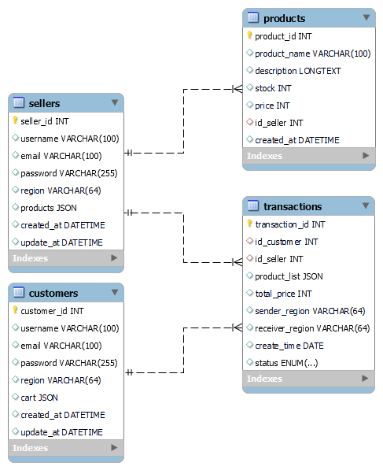

# project-ecommerce-kelas.com
 Belajar back-end dengan kelas.com
## Requirement for this project
- node.js
- express.js
- mysql2
- bcrypt

## Schema Database yang digunakan

## Pengujian pengujian menggunakan postman
[Ini adalah schema pengujian yang saya gunakan mengunakan postman yang telah saya export ke json](resource/Test API backend.postman_collection.json)
